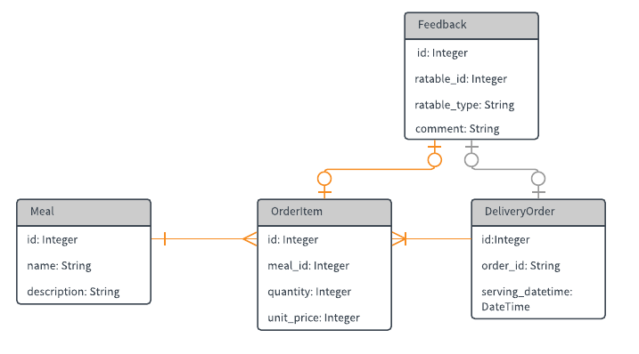

# Nikita Sinhal's Order Feedback API
# Part 1
### Heroku Hosted:
* Single Order [https://ordiez.herokuapp.com/orders/1](https://ordiez.herokuapp.com/orders/1)
* All orders [https://ordiez.herokuapp.com/orders](https://ordiez.herokuapp.com/orders/)


```
   Configuration: $ bundle install

   Database creation: $ rails db:migrate

   Database initialization: $ rails db:seed
    - Clears the DB
    - Creates 10 meals
    - Creates 5 delivery orders that contains any number of order items ranging from 1 to 5

   Test instructions: $ rspec spec

   Deployment instructions: $ rails server
```

## Built on:
Rails 5
Postgres
rspec


## Models



## Sample API JSON response
Path: /orders
```
{
  "orders": [
    {
      "order_id": "GO123",
      "delivery_date": "2017-10-20",
      "delivery_time": "11:00–11:30AM"
    },
    {
      "order_id": "GO124",
      "delivery_date": "2017-10-20",
      "delivery_time": "11:00–11:30AM"
    }
  ]
}
```
Path: /orders/:order_id
```
{
  "order": {
    "order_id": "GO123",
    "delivery_date": "2017-10-20",
    "delivery_time": "11:00–11:30AM",
    "order_items": [
      {
        "name": "Buffalo Chicken on Sweet Potato Mash and Celery Confit ",
        "quantity": 2,
        "total_price": 2390
      }
    ]
  }
}
```

## Gems used:
gem 'rspec-rails'
gem 'shoulda'
gem 'factory_bot_rails' (formerly knows as factory-girl)


# Part II

 Users will be able to make 1 delivery feedback, and n number of meal feedback per order, where n is the number of order items that the order contains.

```
GET: /orders
{
  "orders": [
    {
      "id": 123,
      "order_id": "GO123",
      "delivery_date": "2017-10-20",
      "delivery_time": "11:00–11:30AM",
      "feedback_submitted": false,
      "order_items": [
        {
          "order_item_id": 1,
          "name": "Buffalo Chicken on Sweet Potato Mash and Celery Confit"
        },
        {
          "order_item_id": 2,
          "name": "Chocolate Banana Crumble Tart with praline & caramel sauce"
        }
      ]
    }
```

```
    POST: /orders/:order_id/feedbacks
    {
      "feedbacks": [
        {
          "ratable_id": 123,
          "ratable_type": "DeliveryOrder",
          "comment": "Delivery was prompt and rider was kind, but he forgot cutleries"
        },
        {
          "ratable_id": 1,
          "ratable_type": "OrderItem",
          "comment": "The food portion was too little, was alittle hungry after"
        }
        {
          "ratable_id": 2,
          "ratable_type": "OrderItem",
          "comment": "It was super tasty and I loved it"
        }
      ]
    }
```

```
Example response:
{
  "status": "OK"
}
```


```
GET: /orders/:order_id/feedbacks
{
  "feedbacks": [
    {
      "ratable_id": 123,
      "ratable_type": "DeliveryOrder",
      "rating": 4,
      "comment": "Delivery was prompt and rider was kind, but he forgot cutleries"
    },
    {
      "ratable_id": 1,
      "ratable_type": "OrderItem",
      "rating": 3,
      "comment": "The food portion was too little, was alittle hungry after"
    }
    {
      "ratable_id": 2,
      "ratable_type": "OrderItem",
      "rating": 5,
      "comment": "It was super tasty and I loved it"
    }
  ]
}
```
